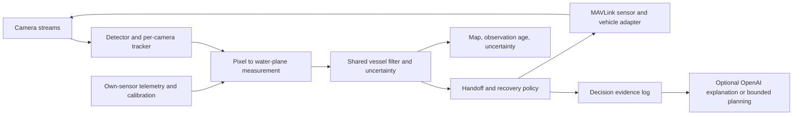

# Research and system design

**Application mapping:** this research began as the NORTHSTAR concept and now informs Operation Overwatch in this repository. Follow [the four-person setup](../team/README.md) and [existing-code contract](../team/CONTRACT.md). Improve the existing `backend/tracker.py`, `SimAdapter` and WebSocket pipeline; do not create a competing runtime. FilterPy and other libraries below are evaluated options, not new dependencies already installed. The repository's public lat/lon and north/east conventions remain authoritative; local XY notation below is mathematical illustration.

Researched September 19, 2026. Primary sources are linked next to claims. Published benchmark results, local observations, and engineering proposals are separated. Public datasets and model weights were not downloaded or run during this research.

## Recommended idea: predictive sensor handoff

Build one shared vessel track from the tower and drone observations. Predict when the current camera will stop providing a useful view, prepare the next observer in advance, and deliberately search the expanding uncertainty region after contact is lost.

This produces a clear experimental question: **does predictive handoff reduce tracking gaps compared with waiting until contact is lost, under the same sensor and compute budget?**

Three related ideas are worth distinguishing:

| Idea | Technical contribution in this project | Priority |
|---|---|---|
| Predictive handoff | Rank reachable observers by viewing geometry, uncertainty reduction, and acquisition time; overlap observations when possible | Main feature |
| Water-constrained recovery | Search plausible water regions after loss; avoid sending every asset to the same last-known point | Second feature, after map conversion works |
| Adaptive detector effort | Spend extra inference on uncertain regions or small objects, while retaining periodic full-frame searches | Stretch; measure latency and missed detections |

These combine established ideas. The project should claim a useful integration and demonstrated improvement, not that Kalman filtering or active sensor management was invented here.

## 1. Existing trackers to reuse

| Component | Existing implementation | What to use it for | Limitation |
|---|---|---|---|
| Per-camera association | [ByteTrack](https://github.com/FoundationVision/ByteTrack) | Associate detections across frames, including weaker detections that match an existing track | Requires a detector; IDs are local to a video, not geographical or cross-camera IDs |
| Moving-camera association | [BoT-SORT](https://github.com/NirAharon/BoT-SORT) | Test motion compensation if drone turns disrupt box association | Its original appearance models and pedestrian results do not establish vessel performance |
| Shared position/velocity estimate | [FilterPy KalmanFilter](https://filterpy.readthedocs.io/en/latest/kalman/KalmanFilter.html) | Small constant-velocity world tracker with per-observation noise | Needs correct coordinates, timing, and tuning |
| Larger tracking framework | [Stone Soup](https://stonesoup.readthedocs.io/en/latest/auto_tutorials/sensormanagement/01_SingleSensorManagement.html) | Reference sensor management, filtering, and evaluation implementations | Broader integration cost than a single FilterPy tracker |
| Video metrics | [TrackEval](https://github.com/JonathonLuiten/TrackEval) | HOTA, IDF1, MOTA and related metrics on annotated clips | Does not by itself evaluate geographical handoff or recovery |

**Default choice:** use an existing pretrained boat-capable detector, ByteTrack per camera, and FilterPy for one shared world track. Keep BoT-SORT as an experiment if camera motion causes measured failures. The [Ultralytics tracker interface](https://docs.ultralytics.com/modes/track/) provides integrations; keep separate tracker state per camera and explicitly choose the tracker. Confirm the selected model's class names and test it on simulator frames before committing to it.

Do not retrain a detector before establishing that the unmodified detector actually fails on a held-out simulator sample. Do not treat any library's demonstration FPS as this machine's throughput.

## 2. Published evidence that informs the design

The MaCVi 2023 report gives the following SeaDronesSee-MOT **test-set whole-pipeline** results, rounded as published:

| Pipeline | HOTA | MOTA | IDF1 |
|---|---:|---:|---:|
| Tracktor baseline | 0.46 | 0.48 | 0.50 |
| byteTracker submission | 0.65 | 0.77 | 0.77 |
| MoveSORT | 0.67 | 0.80 | 0.77 |

Different detectors/training were used; this is not an isolated tracker comparison. Table 16 also reports an ablation: DeepSORT HOTA 62.7% becomes 66.6% after camera alignment, changed matching, and noise-adaptive filtering. Its caption does not identify the split. These historical results motivate testing motion/noise handling; they predict no ArcticSim score. [Report, Tables 10 and 16](https://arxiv.org/html/2211.13508v1)

## 3. Useful datasets and what each can prove

| Dataset | Verified data | Best use here | Important boundary |
|---|---|---|---|
| [SeaDronesSee detection v2](https://seadronessee.cs.uni-tuebingen.de/wacv23_SeaDronesSee) | 14,227 images; 8,930 train / 1,547 validation / 3,750 test; UAV views from 5–260 m; boat is an annotated class | Aerial detector sanity check; choose a fixed validation subset | Hidden test labels; camera metadata is not vessel world-coordinate truth |
| [SeaDronesSee MOT](https://seadronessee.cs.uni-tuebingen.de/wacv23_SeaDronesSee_tracking) | Challenge release lists 21 train / 17 validation / 19 test clips, 54,105 frames; public YOLOv7 detections | Compare association methods on the same detections without training | Short-term identity, merged classes; does not prove long-gap or cross-camera reacquisition |
| [Singapore Maritime Dataset](https://sites.google.com/site/dilipprasad/home/singapore-maritime-dataset) | 81 videos: 40 visible shore-based, 11 visible onboard, 30 near-infrared shore-based; detection/tracking annotations | Visible shore videos resemble tower viewpoints | Not aerial; split by complete video, not adjacent frames |
| [LaRS](https://lojzezust.github.io/lars-dataset/) | 4,006 labeled keyframes; nine prior context frames per keyframe; single-frame images listed as 966 MB | Water/shoreline/clutter segmentation experiments | Context frames are not all labeled; not a fully annotated MOT sequence set |
| [MODS](https://www.macvi.org/workshop/macvi23/challenges/usv_det) | 94 USV sequences, about 8,000 annotated frames, over 60,000 objects | Optional water-obstacle stress test | On-water viewpoint; official challenge says not to train on MODS |

Use the specific SeaDronesSee release manifest: an older overview reports a different clip count. Keep dataset version, subset IDs, and class mapping in the experiment record.

**Data strategy for this build:** spend most validation effort on your actual simulator. Collect distinct runs with visible boats, empty water, shoreline clutter, small targets, moving cameras, and temporary losses. Annotate roughly 100–200 selected frames for a first diagnostic set; that is a proposed workload, not a statistically sufficient benchmark. Hold out complete episodes. A small SeaDronesSee validation experiment is optional after the simulator baseline works. Download only the required subset when possible; listed links do not guarantee instant access.

The real-water datasets have different textures, optics and lighting from this rendered scene. Success on either domain does not establish performance on the other.

## 4. Architecture



The central vessel ID belongs to the shared filter. A tower's local track ID and a drone's local track ID have no inherent relationship.

### Convert the observation into a measurement

A detector supplies pixels. MAVLink supplies the observing platform's pose. Neither alone gives vessel latitude/longitude.

Declare a local **z-up frame with water at z = 0**; convert NED telemetry into that frame explicitly. For calibrated intrinsics `K`, camera center `C`, and the rotation from optical to world coordinates `R`, form a ray:

```text
q = inverse(K) * [pixel_u, pixel_v, 1]
d = R * q
distance_parameter = -C.z / d.z
water_point = C + distance_parameter * d
```

Use a vessel water-contact point, not its roof or arbitrary bounding-box center. Require a downward ray, positive intersection, and plausible range. Use altitude relative to sea level, not home. Include camera mounting offsets. This uses the simulator's flat water plane; it is not a general solution to waves or arbitrary terrain. Established maritime rectification work discusses sea-plane projection and orientation-error propagation. [Schwendeman & Thomson, 2015](https://faculty.washington.edu/jmt3rd/Publications/Schwendeman-Thomson_2015_videostabilization.pdf)

Geometry can dominate accuracy: from `range = height * cot(depression)`, the first-order angular contribution is `sigma_range ≈ height * csc(depression)^2 * sigma_angle`. **Our calculation:** 120 m height, 5° downward angle, and 0.3° angular standard deviation imply about 83 m range standard deviation. This is an illustration, not a measured simulator error. A highly confident boat classification can still produce a poor location estimate.

### Track one vessel in metres

Maintain state `[x, y, vx, vy]` in one explicitly defined local metric frame and covariance `P`. Use the actual time delta when predicting. FilterPy's linear filter is enough after reliable XY measurements exist; a nonlinear bearing-only filter is later work.

For each genuinely new measurement `z` with covariance `Rmeasurement`:

1. Predict the state to its measurement time.
2. Gate its innovation against predicted measurement covariance.
3. Update if plausible; otherwise log the rejection.
4. Confirm a tentative track only after several consistent observations.
5. During gaps, predict and grow covariance; preserve `last_observed_at`.

Use geometry and observed residuals to tune measurement uncertainty. Detector confidence is not automatically a calibrated probability or inverse variance. Avoid adding two arbitrary detector scores to display “94% confidence.”

Only real detector observations update the world filter. Project the matched raw detector observation, not ByteTrack's smoothed box, which already contains past information. A prediction through a missed frame is not a second measurement. Deduplicate by sensor/frame/detection ID. Repeated views and shared calibration errors may be correlated; naive fusion can become overconfident. Start conservatively and inspect consistency. If later combining already-filtered world tracks, [covariance intersection](https://stonesoup.readthedocs.io/en/latest/auto_examples/trackfusion/Track2Track_Fusion_Example.html) is relevant; central raw-measurement fusion is simpler initially.

### Make the next observation deliberate

Stone Soup's sensor-management examples choose actions based on expected reduction in uncertainty. Adapt that idea to available camera poses, ranges, and movement limits. [Sensor manager reference](https://stonesoup.readthedocs.io/en/latest/stonesoup.sensormanager.html)

Our proposed policy evaluates a small, feasible candidate set. For each action:

```text
utility = view_success_estimate * normalized_position_uncertainty_reduction
          - lambda_time * normalized_acquisition_time
          - lambda_switch * switch_cost
```

Use only position covariance for the uncertainty term; mixing raw position and velocity units in a trace would be arbitrary. Normalize costs and freeze weights before testing. Initially use transparent view-quality heuristics rather than claim a calibrated detection probability. Log the terms so the decision can be inspected.

Reject candidates beyond clipping range, behind terrain when visibility is known, outside pan/tilt limits, or unreachable by the drone. Predict the target at the expected arrival time. Switch only when a candidate is materially better to avoid oscillation. Seek overlap: retain the old observer until the new sensor confirms, when geometry permits. If no feasible observer exists, report that limitation rather than invent an assignment.

Before first contact, use complementary water-area sweeps. After a loss, search the predicted uncertainty region first. A negative observation should reduce belief only in the area actually visible and searched with adequate sensitivity. A blank or disconnected camera does not prove absence. Water constraints should limit search candidates, not silently snap a Gaussian estimate onto shore and declare lower uncertainty.

### Timing is a first-class input

The current MJPEG stream lacks capture timestamps. Store frame receipt time, telemetry time, processing completion, and whether capture time is unknown. Until capture timing exists, receipt time is only an approximate measurement time: pair it with the nearest/interpolated buffered camera pose and include timing uncertainty. Use a single latest-frame reader per stream, discard backlog, and initially observe after motion settles. Reject measurements during fast sensor motion or unbounded delay. Settling reduces pose error but does not remove vessel-motion error from stale frames. Do not call receive-to-publish latency “capture latency.” Keep simulator and wall-clock time separate, especially under variable simulation speed.

If capture timing becomes available, process in timestamp order with a short buffer. Count late/dropped observations. More sophisticated delayed-measurement processing exists, but is not needed before a working baseline. [Stone Soup delayed-measurement example](https://stonesoup.readthedocs.io/en/v1.7/auto_examples/oosm/example_oosm_algorithm.html)

## 5. Extensions justified by failures

- **BoT-SORT / alignment:** if association breaks during camera motion. Preserve the same detector in the comparison.
- **SAHI:** if distant boats become too small after resizing. It tiles images and merges detections; measure total inference cost and duplicate suppression. Cropping cannot restore details that were never rendered. [SAHI implementation](https://github.com/obss/sahi), [original paper](https://arxiv.org/abs/2202.06934)
- **IMM:** if turns repeatedly defeat the constant-velocity model. It combines motion models but introduces transition/noise tuning. [FilterPy IMM](https://filterpy.readthedocs.io/en/latest/kalman/IMMEstimator.html)
- **Bearing-only or two-view localization:** if sea-plane ranges are unstable. Initialization and synchronized geometry are additional work; do not initialize from hidden target truth.
- **OpenAI:** event-level explanation or selection among validated mission actions. Supply observation IDs and estimated state, validate tool arguments, and keep deterministic tracking running during API delays. Function calling connects model proposals to application-owned tools; schema conformance does not prove a correct mission decision. [Official function-calling guide](https://developers.openai.com/api/docs/guides/function-calling)

The strongest first submission is the two-sensor track with measured recovery. A complex model or large sponsor stack is justified only by a demonstrated need.
