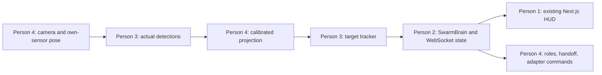

# Four-person project setup

Repository: [Yd025/HTNV1](https://github.com/Yd025/HTNV1). Work from `dev`, open feature PRs into `dev`, and promote a verified demo to `main`. Each person uses a separate clone/worktree.

This setup extends the existing **Operation Overwatch** implementation. The NORTHSTAR research supplies the predictive tracking/handoff direction; it does not replace the existing Next.js, FastAPI, SwarmBrain or SimAdapter architecture.

| Person | Assignment | Branch | Primary ownership |
|---|---|---|---|
| 1 | [UI / mission control](01-ui.md) | `codex/ui` | `frontend/**` |
| 2 | [Backend / API / integration](02-backend.md) | `codex/backend` | `backend/main.py`, `brain.py`, `world.py`, `db.py`, deployment and shared contracts |
| 3 | [Vision / target tracking / evaluation](03-vision-tracking.md) | `codex/vision-tracking` | `backend/tracker.py`, `metrics.py`, `eval.py`, new `backend/vision/**` |
| 4 | [Simulator / geometry / autonomy](04-simulator-autonomy.md) | `codex/simulator-autonomy` | `backend/sim/**` except shared types, `mavlink_connection.py`, `allocator.py`, `agents/**`, `behaviors/**` |

Assign a teammate to each row. Person 2 is the integrator and coordinates `backend/sim/types.py`, `backend/geo.py`, `frontend/lib/types.ts`, the single Python requirements file, shared Docker/configuration and the wire format. Functional owners propose shared changes; one owner lands them so concurrent branches stay compatible.

## First steps

1. Read [AGENTS.md](../../AGENTS.md) and your handoff above.
2. Clone the repo and check out your already-created branch using [GIT_WORKFLOW.md](GIT_WORKFLOW.md).
3. Read [CONTRACT.md](CONTRACT.md): keep the existing `/ws/telemetry`, `Detection`, `Track`, and `SimAdapter` interfaces.
4. Start with the existing local kinematic adapter. Only Person 4 needs the real ArcticSim initially.
5. Merge one small working slice in the first 60–90 minutes. Everyone updates from `origin/dev` before the next PR.

Each handoff has a starting task, owned files, integration boundary, validation, and a prompt to give a coding assistant.

## The pipeline

Keep one deterministic brain. Detection workers may process frames outside the fast tick; `poll_detections()` drains already-available measurements. All simulator I/O stays behind `SimAdapter`. OpenAI remains a slow optional advisor.

## Small merge milestones

| Stage | What lands on `dev` |
|---|---|
| First independent slices | UI uses actual existing state; backend logs/replays it; vision verifies target-filter behavior; simulator produces verified camera/pose input |
| First live observation | Raw boat detection -> calibrated target measurement -> existing tracker -> HUD |
| Handoff | One tower/copter transfer, prediction clearly distinguished from visual evidence |
| Evidence | Reactive versus predictive policy runs, reported failures, measured recovery and location error when truth exists |
| Demo | A tested `dev` commit is merged to `main` |

The current local adapter is a stand-in, not a real detector benchmark. The WHITEOUT camera detection path still needs implementation. See [research](../research/TRACKING_RESEARCH.md) and [evaluation protocol](../research/EVALUATION.md).
